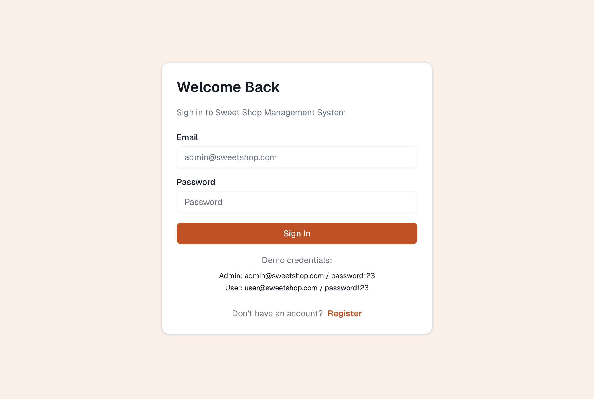
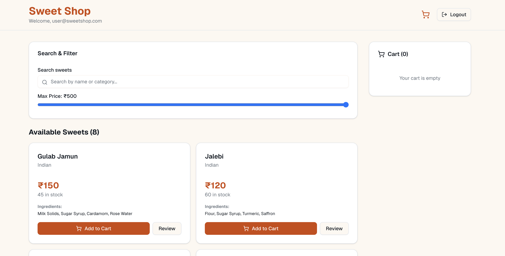
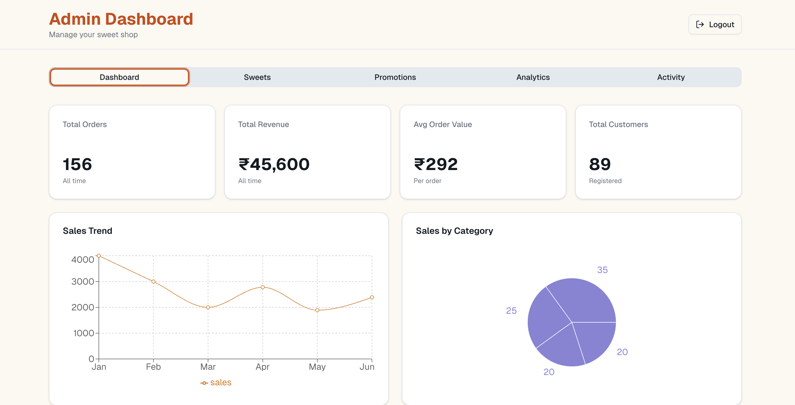
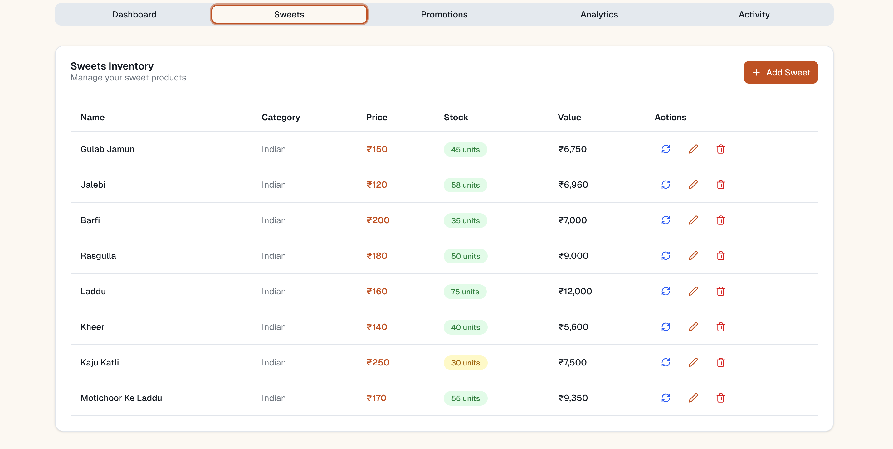

#  Sweet Shop Management System

A full-stack **Next.js + TypeScript** web application for managing a sweet shop — built to handle **user authentication, sweet inventory, purchases, reviews, promotions, and admin analytics** — all in a single modern, serverless app.

Hosted webside: v0-sweet-shop-system-brown.vercel.app
---

##  Table of Contents
- [Project Overview](#project-overview)
- [Features](#features)
- [Tech Stack](#tech-stack)
- [Folder Structure](#folder-structure)
- [Setup and Installation](#setup-and-installation)
- [Running the Application](#running-the-application)
- [Testing](#testing)
- [Screenshots](#screenshots)
- [My AI Usage](#my-ai-usage)


---

##  Project Overview

The **Sweet Shop Management System** simplifies daily operations for a sweet shop.  
It allows **customers** to browse and purchase sweets, while **admins** can manage inventory, review analytics, and track activities — all from a clean, responsive interface.

Key highlights:
- Secure authentication for customers and admins.
- Dynamic sweet listing with categories and search.
- Stock management (purchase + restock).
- Admin dashboard with insights and activity logs.
- Review and promotions modules for engagement.

---

##  Features

| Category | Features |
|-----------|-----------|
| **Authentication** | Register, login, JWT-based session, admin roles |
| **Sweet Inventory** | Add, update, delete, restock, purchase sweets |
| **Admin Dashboard** | View statistics, recent activities, and inventory summary |
| **Promotions** | Manage special offers |
| **Reviews** | Customers can post and view sweet reviews |
| **UI/UX** | Built with Tailwind CSS + shadcn/ui components for a modern, responsive interface |

---

##  Tech Stack

**Frontend + Backend (monorepo)**  
- Next.js 14 (App Router)
- React 18
- TypeScript
- Tailwind CSS
- shadcn/ui
- PostgreSQL (SQLite for local testing)
- Jest / React Testing Library

---

## Folder Structure

```
sweet-shop/
├── app/                 # App router pages & API routes
│   ├── auth/            # login/register pages
│   ├── shop/            # shop UI
│   ├── admin/           # admin dashboard
│   └── api/             # backend API routes
│       ├── auth/        # login, register
│       ├── sweets/      # sweets CRUD + restock + purchase
│       ├── reviews/     # reviews endpoint
│       ├── orders/      # order management
│       └── admin/       # admin analytics & activity logs
├── public/              # static assets
├── styles/ or app/globals.css
├── package.json
└── tsconfig.json
```

---

##  Setup and Installation

### 1️⃣ Clone the repository
```bash
git clone https://github.com/<your-username>/sweet-shop.git
cd sweet-shop
```

### 2️⃣ Install dependencies
Using **pnpm** (recommended):
```bash
pnpm install
```
or with npm:
```bash
npm install
```

### 3️⃣ Configure environment variables  
Create a `.env` file in the root directory:
```bash
DATABASE_URL="postgresql://<user>:<password>@localhost:5432/sweetshop"
JWT_SECRET="your_jwt_secret_here"
NEXT_PUBLIC_API_URL="http://localhost:3000"
```

If using SQLite locally:
```bash
DATABASE_URL="file:./dev.db"
```

###  Run the development server
```bash
pnpm run dev
```

Then open [http://localhost:3000](http://localhost:3000).

---

##  Running the Application

| Environment | Command | Description |
|--------------|----------|-------------|
| Development | `pnpm dev` | Runs local dev server |
| Build | `pnpm build` | Builds optimized production bundle |
| Start | `pnpm start` | Runs production build |
| Lint | `pnpm lint` | Runs code linter |
| Test | `pnpm test` | Executes test suite |

---

##  Screenshots


| Description | Screenshot |
|--------------|-------------|
| **Login Page** |  |
| **Shop Page** |  |
| **Admin Dashboard** |  |
| **Sweet Management** |  |

---

##  My AI Usage

> As required, this section transparently documents how AI was used during this project.

- **Tools used:** ChatGPT (GPT-5) and GitHub Copilot  
- **Purpose:**  
  - Used ChatGPT to scaffold backend API routes, Prisma schema, and README.  
  - Generated test examples and helped with debugging.  
  - Used Copilot for small UI boilerplate (forms, validation).  
- **Verification:**  
  - All AI-generated code was reviewed, debugged, and modified.  
  - Authentication and DB logic were manually verified.  
- **Commit Co-authorship:**  
  - For AI-assisted commits, the following trailer was used:
    ```
    Co-authored-by: ChatGPT <AI@users.noreply.github.com>
    ```
- **Reflection:**  
  - AI reduced setup time and improved clarity in structuring a full-stack app.  
  - Manual oversight ensured correctness and security.


